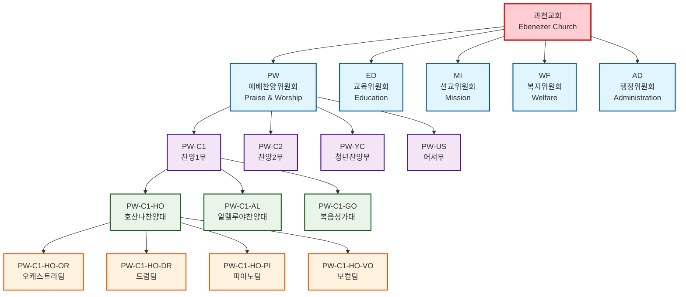
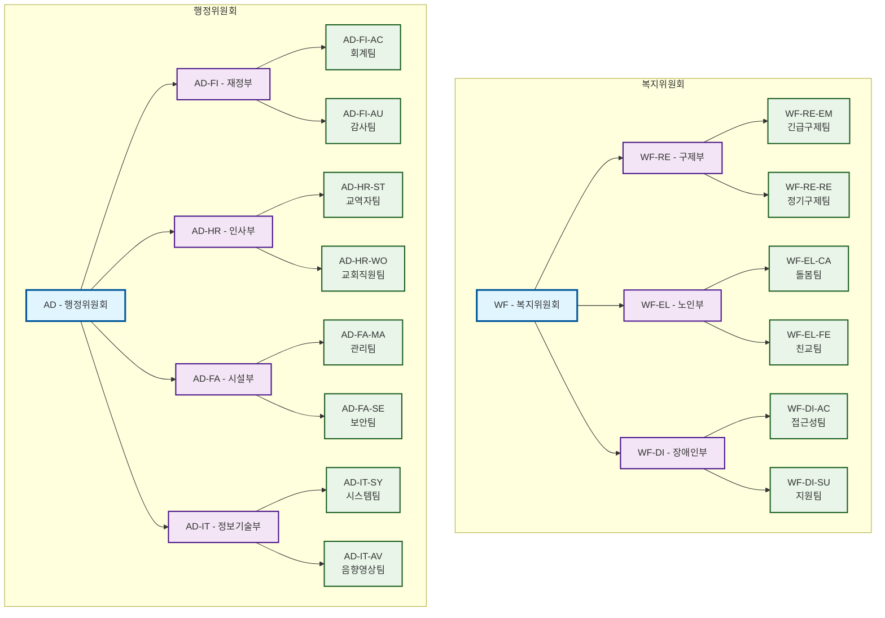

# 과천교회 조직도 다이어그램

## 🏛️ 전체 조직 구조도



## 🎵 예배찬양위원회 상세 조직도

```mermaid
graph TB
    PW[PW - 예배찬양위원회]
    
    %% 찬양1부
    PW_C1[PW-C1 - 찬양1부]
    PW_C1_HO[PW-C1-HO - 호산나찬양대]
    PW_C1_AL[PW-C1-AL - 알렐루야찬양대]
    PW_C1_GO[PW-C1-GO - 복음성가대]
    
    PW_C1_HO_OR[PW-C1-HO-OR<br/>오케스트라팀]
    PW_C1_HO_DR[PW-C1-HO-DR<br/>드럼팀]
    PW_C1_HO_PI[PW-C1-HO-PI<br/>피아노팀]
    PW_C1_HO_VO[PW-C1-HO-VO<br/>보컬팀]
    
    PW_C1_AL_VO[PW-C1-AL-VO<br/>보컬팀]
    PW_C1_AL_IN[PW-C1-AL-IN<br/>악기팀]
    
    PW_C1_GO_SO[PW-C1-GO-SO<br/>솔로팀]
    PW_C1_GO_CH[PW-C1-GO-CH<br/>합창팀]
    
    %% 찬양2부
    PW_C2[PW-C2 - 찬양2부]
    PW_C2_PR[PW-C2-PR - 프레이즈찬양대]
    PW_C2_WO[PW-C2-WO - 경배찬양대]
    
    PW_C2_PR_BA[PW-C2-PR-BA<br/>밴드팀]
    PW_C2_PR_VO[PW-C2-PR-VO<br/>보컬팀]
    
    PW_C2_WO_LE[PW-C2-WO-LE<br/>리더팀]
    PW_C2_WO_SU[PW-C2-WO-SU<br/>서포트팀]
    
    %% 청년찬양부
    PW_YC[PW-YC - 청년찬양부]
    PW_YC_CC[PW-YC-CC - 컨템포러리찬양대]
    PW_YC_AC[PW-YC-AC - 어쿠스틱찬양대]
    
    PW_YC_CC_BA[PW-YC-CC-BA<br/>밴드팀]
    PW_YC_CC_DA[PW-YC-CC-DA<br/>댄스팀]
    
    PW_YC_AC_GU[PW-YC-AC-GU<br/>기타팀]
    PW_YC_AC_CA[PW-YC-AC-CA<br/>카혼팀]
    
    %% 어셔부
    PW_US[PW-US - 어셔부]
    PW_US_WE[PW-US-WE - 환영팀]
    PW_US_OR[PW-US-OR - 질서팀]
    
    PW_US_WE_GR[PW-US-WE-GR<br/>인사팀]
    PW_US_WE_GU[PW-US-WE-GU<br/>안내팀]
    
    PW_US_OR_IN[PW-US-OR-IN<br/>실내팀]
    PW_US_OR_OU[PW-US-OR-OU<br/>실외팀]
    
    %% 연결 관계
    PW --> PW_C1
    PW --> PW_C2
    PW --> PW_YC
    PW --> PW_US
    
    PW_C1 --> PW_C1_HO
    PW_C1 --> PW_C1_AL
    PW_C1 --> PW_C1_GO
    
    PW_C1_HO --> PW_C1_HO_OR
    PW_C1_HO --> PW_C1_HO_DR
    PW_C1_HO --> PW_C1_HO_PI
    PW_C1_HO --> PW_C1_HO_VO
    
    PW_C1_AL --> PW_C1_AL_VO
    PW_C1_AL --> PW_C1_AL_IN
    
    PW_C1_GO --> PW_C1_GO_SO
    PW_C1_GO --> PW_C1_GO_CH
    
    PW_C2 --> PW_C2_PR
    PW_C2 --> PW_C2_WO
    
    PW_C2_PR --> PW_C2_PR_BA
    PW_C2_PR --> PW_C2_PR_VO
    
    PW_C2_WO --> PW_C2_WO_LE
    PW_C2_WO --> PW_C2_WO_SU
    
    PW_YC --> PW_YC_CC
    PW_YC --> PW_YC_AC
    
    PW_YC_CC --> PW_YC_CC_BA
    PW_YC_CC --> PW_YC_CC_DA
    
    PW_YC_AC --> PW_YC_AC_GU
    PW_YC_AC --> PW_YC_AC_CA
    
    PW_US --> PW_US_WE
    PW_US --> PW_US_OR
    
    PW_US_WE --> PW_US_WE_GR
    PW_US_WE --> PW_US_WE_GU
    
    PW_US_OR --> PW_US_OR_IN
    PW_US_OR --> PW_US_OR_OU
    
    classDef committee fill:#e1f5fe,stroke:#01579b,stroke-width:3px
    classDef department fill:#f3e5f5,stroke:#4a148c,stroke-width:2px
    classDef team fill:#e8f5e8,stroke:#1b5e20,stroke-width:2px
    classDef subteam fill:#fff3e0,stroke:#e65100,stroke-width:1px
    
    class PW committee
    class PW_C1,PW_C2,PW_YC,PW_US department
    class PW_C1_HO,PW_C1_AL,PW_C1_GO,PW_C2_PR,PW_C2_WO,PW_YC_CC,PW_YC_AC,PW_US_WE,PW_US_OR team
    class PW_C1_HO_OR,PW_C1_HO_DR,PW_C1_HO_PI,PW_C1_HO_VO,PW_C1_AL_VO,PW_C1_AL_IN,PW_C1_GO_SO,PW_C1_GO_CH,PW_C2_PR_BA,PW_C2_PR_VO,PW_C2_WO_LE,PW_C2_WO_SU,PW_YC_CC_BA,PW_YC_CC_DA,PW_YC_AC_GU,PW_YC_AC_CA,PW_US_WE_GR,PW_US_WE_GU,PW_US_OR_IN,PW_US_OR_OU subteam
```



## 📚 교육위원회 상세 조직도

```mermaid
graph TB
    ED[ED - 교육위원회]
    
    %% 주일학교부
    ED_SS[ED-SS - 주일학교부]
    ED_SS_IN[ED-SS-IN - 영유아부]
    ED_SS_CH[ED-SS-CH - 유치부]
    ED_SS_EL[ED-SS-EL - 초등부]
    ED_SS_MI[ED-SS-MI - 중등부]
    ED_SS_HI[ED-SS-HI - 고등부]
    
    ED_SS_IN_NU[ED-SS-IN-NU<br/>어린이집]
    ED_SS_IN_TO[ED-SS-IN-TO<br/>토들러]
    
    ED_SS_CH_PR[ED-SS-CH-PR<br/>유치부1]
    ED_SS_CH_KI[ED-SS-CH-KI<br/>유치부2]
    
    ED_SS_EL_LO[ED-SS-EL-LO<br/>저학년부]
    ED_SS_EL_UP[ED-SS-EL-UP<br/>고학년부]
    
    ED_SS_MI_M1[ED-SS-MI-M1<br/>중1부]
    ED_SS_MI_M2[ED-SS-MI-M2<br/>중2부]
    ED_SS_MI_M3[ED-SS-MI-M3<br/>중3부]
    
    ED_SS_HI_H1[ED-SS-HI-H1<br/>고1부]
    ED_SS_HI_H2[ED-SS-HI-H2<br/>고2부]
    ED_SS_HI_H3[ED-SS-HI-H3<br/>고3부]
    
    %% 청년부
    ED_YO[ED-YO - 청년부]
    ED_YO_CO[ED-YO-CO - 대학부]
    ED_YO_YA[ED-YO-YA - 청년부]
    
    ED_YO_CO_FR[ED-YO-CO-FR<br/>신입생부]
    ED_YO_CO_SE[ED-YO-CO-SE<br/>고학년부]
    
    ED_YO_YA_SI[ED-YO-YA-SI<br/>미혼부]
    ED_YO_YA_NE[ED-YO-YA-NE<br/>신혼부]
    
    %% 성인부
    ED_AD[ED-AD - 성인부]
    ED_AD_BI[ED-AD-BI - 성경공부부]
    ED_AD_SE[ED-AD-SE - 세미나부]
    
    ED_AD_BI_BE[ED-AD-BI-BE<br/>초급반]
    ED_AD_BI_AD[ED-AD-BI-AD<br/>고급반]
    
    ED_AD_SE_MA[ED-AD-SE-MA<br/>결혼세미나]
    ED_AD_SE_PA[ED-AD-SE-PA<br/>부모세미나]
    
    %% 연결 관계
    ED --> ED_SS
    ED --> ED_YO
    ED --> ED_AD
    
    ED_SS --> ED_SS_IN
    ED_SS --> ED_SS_CH
    ED_SS --> ED_SS_EL
    ED_SS --> ED_SS_MI
    ED_SS --> ED_SS_HI
    
    ED_SS_IN --> ED_SS_IN_NU
    ED_SS_IN --> ED_SS_IN_TO
    
    ED_SS_CH --> ED_SS_CH_PR
    ED_SS_CH --> ED_SS_CH_KI
    
    ED_SS_EL --> ED_SS_EL_LO
    ED_SS_EL --> ED_SS_EL_UP
    
    ED_SS_MI --> ED_SS_MI_M1
    ED_SS_MI --> ED_SS_MI_M2
    ED_SS_MI --> ED_SS_MI_M3
    
    ED_SS_HI --> ED_SS_HI_H1
    ED_SS_HI --> ED_SS_HI_H2
    ED_SS_HI --> ED_SS_HI_H3
    
    ED_YO --> ED_YO_CO
    ED_YO --> ED_YO_YA
    
    ED_YO_CO --> ED_YO_CO_FR
    ED_YO_CO --> ED_YO_CO_SE
    
    ED_YO_YA --> ED_YO_YA_SI
    ED_YO_YA --> ED_YO_YA_NE
    
    ED_AD --> ED_AD_BI
    ED_AD --> ED_AD_SE
    
    ED_AD_BI --> ED_AD_BI_BE
    ED_AD_BI --> ED_AD_BI_AD
    
    ED_AD_SE --> ED_AD_SE_MA
    ED_AD_SE --> ED_AD_SE_PA
    
    classDef committee fill:#e1f5fe,stroke:#01579b,stroke-width:3px
    classDef department fill:#f3e5f5,stroke:#4a148c,stroke-width:2px
    classDef team fill:#e8f5e8,stroke:#1b5e20,stroke-width:2px
    classDef subteam fill:#fff3e0,stroke:#e65100,stroke-width:1px
    
    class ED committee
    class ED_SS,ED_YO,ED_AD department
    class ED_SS_IN,ED_SS_CH,ED_SS_EL,ED_SS_MI,ED_SS_HI,ED_YO_CO,ED_YO_YA,ED_AD_BI,ED_AD_SE team
    class ED_SS_IN_NU,ED_SS_IN_TO,ED_SS_CH_PR,ED_SS_CH_KI,ED_SS_EL_LO,ED_SS_EL_UP,ED_SS_MI_M1,ED_SS_MI_M2,ED_SS_MI_M3,ED_SS_HI_H1,ED_SS_HI_H2,ED_SS_HI_H3,ED_YO_CO_FR,ED_YO_CO_SE,ED_YO_YA_SI,ED_YO_YA_NE,ED_AD_BI_BE,ED_AD_BI_AD,ED_AD_SE_MA,ED_AD_SE_PA subteam
```



## 🌐 선교위원회 상세 조직도

```mermaid
graph TB
    MI[MI - 선교위원회]
    
    %% 국내선교부
    MI_DO[MI-DO - 국내선교부]
    MI_DO_EV[MI-DO-EV - 전도팀]
    MI_DO_CO[MI-DO-CO - 지역사회봉사]
    
    MI_DO_EV_ST[MI-DO-EV-ST<br/>길거리전도]
    MI_DO_EV_VI[MI-DO-EV-VI<br/>방문전도]
    
    MI_DO_CO_FO[MI-DO-CO-FO<br/>급식봉사]
    MI_DO_CO_CL[MI-DO-CO-CL<br/>청소봉사]
    
    %% 해외선교부
    MI_OV[MI-OV - 해외선교부]
    MI_OV_AS[MI-OV-AS - 아시아선교]
    MI_OV_AF[MI-OV-AF - 아프리카선교]
    
    MI_OV_AS_CH[MI-OV-AS-CH<br/>중국선교]
    MI_OV_AS_IN[MI-OV-AS-IN<br/>인도선교]
    
    MI_OV_AF_KE[MI-OV-AF-KE<br/>케냐선교]
    MI_OV_AF_UG[MI-OV-AF-UG<br/>우간다선교]
    
    %% 특별선교부
    MI_SP[MI-SP - 특별선교부]
    MI_SP_PR[MI-SP-PR - 교도소선교]
    MI_SP_HO[MI-SP-HO - 병원선교]
    
    MI_SP_PR_VI[MI-SP-PR-VI<br/>방문팀]
    MI_SP_PR_CO[MI-SP-PR-CO<br/>상담팀]
    
    MI_SP_HO_VI[MI-SP-HO-VI<br/>방문팀]
    MI_SP_HO_CH[MI-SP-HO-CH<br/>찬양팀]
    
    %% 연결 관계
    MI --> MI_DO
    MI --> MI_OV
    MI --> MI_SP
    
    MI_DO --> MI_DO_EV
    MI_DO --> MI_DO_CO
    
    MI_DO_EV --> MI_DO_EV_ST
    MI_DO_EV --> MI_DO_EV_VI
    
    MI_DO_CO --> MI_DO_CO_FO
    MI_DO_CO --> MI_DO_CO_CL
    
    MI_OV --> MI_OV_AS
    MI_OV --> MI_OV_AF
    
    MI_OV_AS --> MI_OV_AS_CH
    MI_OV_AS --> MI_OV_AS_IN
    
    MI_OV_AF --> MI_OV_AF_KE
    MI_OV_AF --> MI_OV_AF_UG
    
    MI_SP --> MI_SP_PR
    MI_SP --> MI_SP_HO
    
    MI_SP_PR --> MI_SP_PR_VI
    MI_SP_PR --> MI_SP_PR_CO
    
    MI_SP_HO --> MI_SP_HO_VI
    MI_SP_HO --> MI_SP_HO_CH
    
    classDef committee fill:#e1f5fe,stroke:#01579b,stroke-width:3px
    classDef department fill:#f3e5f5,stroke:#4a148c,stroke-width:2px
    classDef team fill:#e8f5e8,stroke:#1b5e20,stroke-width:2px
    classDef subteam fill:#fff3e0,stroke:#e65100,stroke-width:1px
    
    class MI committee
    class MI_DO,MI_OV,MI_SP department
    class MI_DO_EV,MI_DO_CO,MI_OV_AS,MI_OV_AF,MI_SP_PR,MI_SP_HO team
    class MI_DO_EV_ST,MI_DO_EV_VI,MI_DO_CO_FO,MI_DO_CO_CL,MI_OV_AS_CH,MI_OV_AS_IN,MI_OV_AF_KE,MI_OV_AF_UG,MI_SP_PR_VI,MI_SP_PR_CO,MI_SP_HO_VI,MI_SP_HO_CH subteam
```



## 🤝 복지위원회 & 행정위원회 조직도



---

## 📊 조직코드 생성 규칙

### 자동 생성 로직
1. **1단계 (위원회)**: 2자리 영문 약어 수동 입력
2. **2단계 (부서)**: 부모코드 + "-" + 2자리 연속번호
3. **3단계 (팀)**: 부모코드 + "-" + 2자리 영문 약어
4. **4단계 (세부조직)**: 부모코드 + "-" + 2자리 영문 약어

### 예시
```
PW (예배찬양위원회)
├── PW-01 → PW-C1 (찬양1부)
│   ├── PW-C1-HO (호산나찬양대)
│   │   ├── PW-C1-HO-OR (오케스트라팀)
│   │   ├── PW-C1-HO-DR (드럼팀)
│   │   └── PW-C1-HO-PI (피아노팀)
│   └── PW-C1-AL (알렐루야찬양대)
└── PW-02 → PW-C2 (찬양2부)
```

이제 체계적인 4단계 조직구조와 조직코드 시스템이 완성되었습니다! 🎉